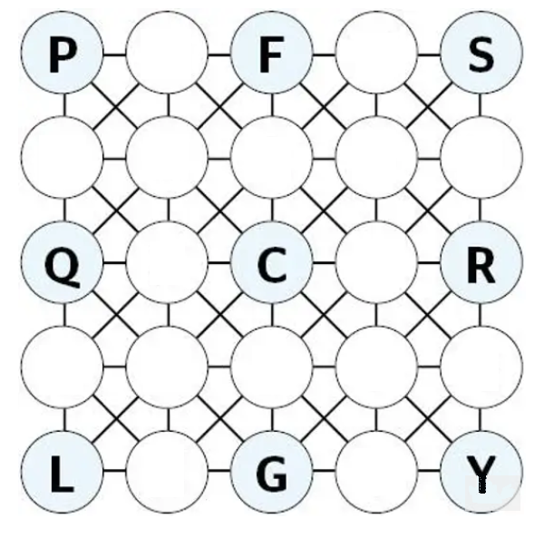

# GOGEN

Evening Standard - Tuesday 18th August 2020

Insert letters to form the listed words, moving between adjacent cells horizontal, vertically or diagonally in any direction. 
Insert the remaining letters of the alphabet (except Z) in the grid so that all the listed words are spelt out this way.

## Words

+ BIRDS
+ BREACH
+ CHUMP
+ FAXING
+ JUNK
+ LOCH
+ LOQUACITY
+ WAVE

## Answer

https://www.standard.co.uk/staticpage/sudoku/puzzles-sudoku-and-gogen-solutions-a2004466.html
